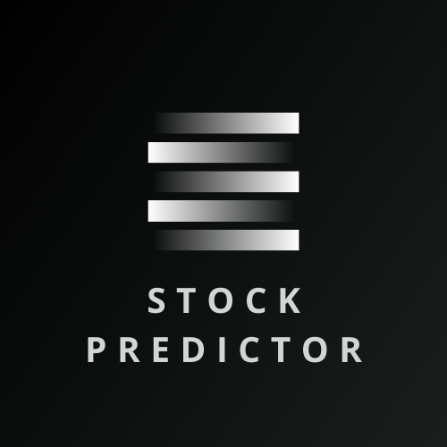

  

<h1 align="center">Stock Price Prediction App</h1>

This is a web application built with Streamlit that allows users to predict stock prices using historical data. Users can input a stock symbol, adjust advanced settings, and visualize the predictions along with the actual stock value over time.

<h2 align="center">Features</h2>

  <strong>Prediction Model:</strong> The app utilizes a Random Forest Classifier model to predict stock prices based on historical data.  
  <strong>Profit Calculation:</strong> It includes a profit calculation function that estimates the profit or loss based on the predictions.  
  <strong>Advanced Settings:</strong> Users can adjust advanced settings such as the start index and step size for the prediction range to customize their analysis.  
  <strong>Visualization:</strong> The app provides interactive plots to visualize the predictions, actual stock values, and other relevant metrics.

<h2 align="center">How It Works</h2>
<ol align="center">
  <li><strong>Input Stock Symbol:</strong> Users enter the stock symbol (e.g., AAPL for Apple) in the text box on the left sidebar.</li>
  <li><strong>Adjust Settings:</strong> Users can adjust advanced settings such as the start index and step size for the prediction range.</li>
  <li><strong>Run Prediction:</strong> After entering the stock symbol and adjusting settings, users click the "Run" button to initiate the prediction process.</li>
  <li><strong>View Results:</strong> The app displays the predictions, actual stock values, and other relevant metrics such as model accuracy and profit/loss.</li>
</ol>
<h2 align="center">Prediction Model</h2>

The app utilizes a Random Forest Classifier model trained on historical stock price data obtained from Yahoo Finance (via the <code>yfinance</code> library). The model predicts whether the stock price will increase or decrease based on features such as closing price, high, low, open, and volume.

<h2 align="center">Profit Calculation</h2>

The profit calculation function estimates the profit or loss based on the predictions generated by the model. It compares the predicted stock price movement with the actual stock price movement and calculates the difference between the closing and opening prices.

<h2 align="center">Getting Started</h2>

To run the app locally, follow these steps:

<ol align="center">
  <li>Clone this repository to your local machine.</li>
  <li>Install the required dependencies by running <code>pip install -r requirements.txt</code>.</li>
  <li>Run the Streamlit app by executing <code>streamlit run app.py</code> in your terminal.</li>
  <li>Access the app in your web browser at <code>http://localhost:8501</code>.</li>
</ol>
<h2 align="center">Deployed Website</h2>

The app is already deployed and accessible online. You can try it out at <a href="https://stock-predictor-pallab2o.streamlit.app/#stock-predictor">Stock Price Prediction App</a>.

<h2 align="center">Feedback and Contributions</h2>

Feedback, bug reports, and contributions are welcome! If you encounter any issues or have suggestions for improvement, please <a href="https://github.com/yourusername/stock-price-prediction-app/issues">open an issue</a> or <a href="https://github.com/yourusername/stock-price-prediction-app/pulls">submit a pull request</a>.

<h2 align="center">Acknowledgments</h2>

This project was inspired by the need for a simple and user-friendly tool to predict stock prices and visualize the results. Special thanks to the Streamlit and Yahoo Finance communities for their contributions and support.

